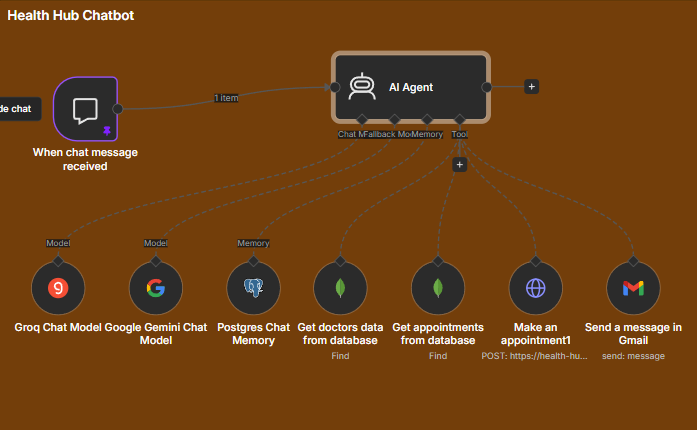

# n8n Medical Assistant Workflows

This is an n8n project for medical assistance workflows, including booking and backend automation.

It is powered by open-source LLMs (**Qwen 3.5-9B** and **OSS-120B**) to optimize inference cost and latency.

I built a system that can:
- Communicate with MongoDB
- Search data from MongoDB
- Interact with backend APIs
- Make appointments

## Workflow Screenshot

